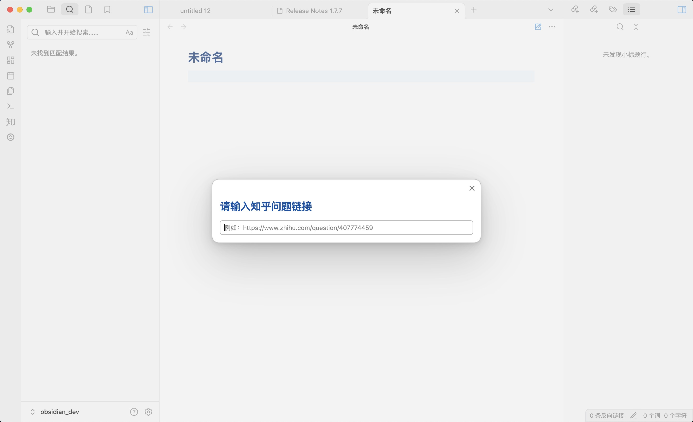

## 发布新的回答

打开 Obsidian 的命令面板，通常快捷键是 `Ctrl+P` 或者 `Command+P`。输入 `Zhihu: Create new answer`，插件会要求你输入问题的链接。

问题链接的格式是：`https://www.zhihu.com/question/id`

回车后会新建一个文件，有`zhihu-question` 属性，记录回答的问题链接。您不需要填写任何属性，直接写完回答后运行命令 `Zhihu: Publish current answer`。然后回答链接就会出现在 `zhihu-link` 属性中。用同样的命令也可以更新回答。

:::caution
您不能在同一个问题下创建两次回答（包括回答草稿）。如果您已经回答过了这个问题，您应该[更新已有回答](./发布回答#更新已有的知乎回答)。
:::

## 更新已有的知乎回答

如果您想要在 Obsidian 内更新已经在知乎创建并发布的回答，可以在知乎网页端复制回答的链接。然后在 Obsidian 内新建一个笔记。打开文件菜单->增加笔记属性(通常快捷键是 `Ctrl+;` 或者 `Command+;`)

增加两个属性：

- `zhihu-question`：问题链接
- `zhihu-link`: 刚刚复制的文章链接

添加文章内容，然后同样运行命令 `Zhihu: Publish current answer` 即可成功更新回答。

:::caution Obsidian 内的回答内容会完全覆盖原有回答。
:::
