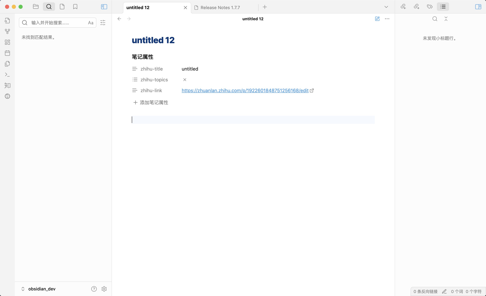
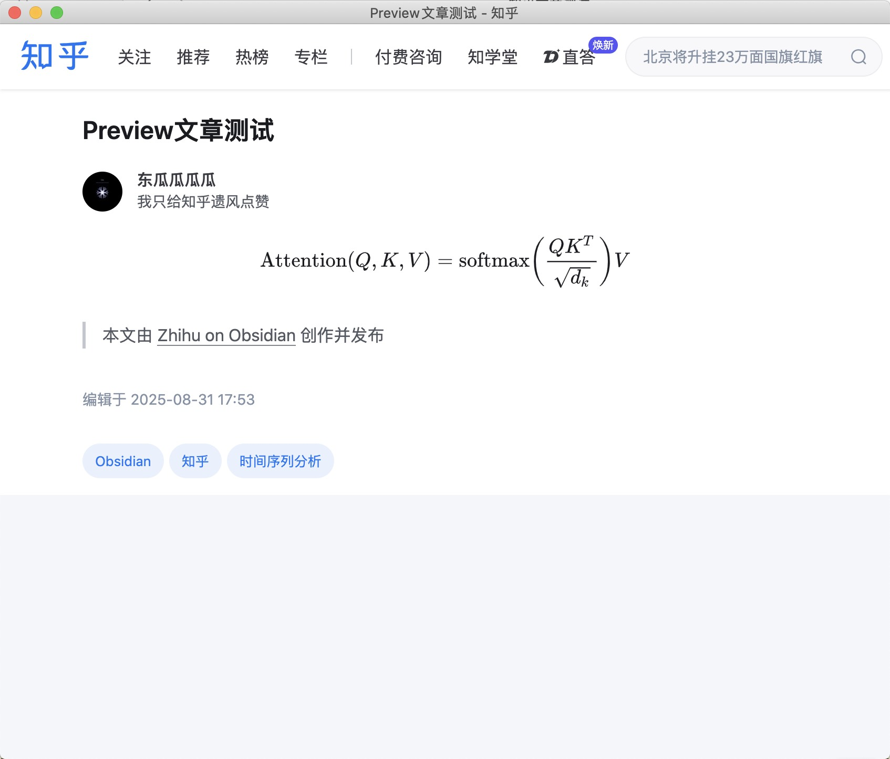

登录知乎后，就可以发布文章或回答。

## 发布新的文章

打开 Obsidian 的命令面板，通常快捷键是 `Ctrl+P` 或者 `Command+P`。输入 `Zhihu: Create new article`

运行后会看到有三个属性(frontmatter)的笔记生成。这三个属性分别是：

- 标题(zhihu-title): 默认为`untitled`, 您可以后续进行修改
- 话题(zhihu-topics): 默认为空，但您必须添加话题才能发布文章
- 链接(zhihu-link): 你的文章的URL

在写完文章准备发表的时候，运行命令 `Zhihu: Publish current article` 即可。插件会将 markdown 转换为知乎HTML。在真正看到知乎上的文章之前，你可能需要等上几秒（或几分钟）。

:::tip 如果想要更新文章，同样地可以运行该命令。
:::

## 更新已有的知乎文章

如果您想要在 Obsidian 内更新已经在知乎创建并发布的文章，可以在知乎网页端复制文章的链接。然后在 Obsidian 内新建一个笔记。打开文件菜单->增加笔记属性(通常快捷键是 `Ctrl+;` 或者 `Command+;`)

增加三个属性：

- `zhihu-title`: 文章的标题
- `zhihu-topics`: 文章的话题
- `zhihu-link`: 刚刚复制的文章链接

添加文章内容，然后同样运行命令 `Zhihu: Publish current article` 即可成功更新文章。

:::caution Obsidian 内的文章内容会完全覆盖原有文章。
:::

## 预览文章

在发布文章之前，您可以先预览一下效果。运行命令 `Zhihu: Preview current article` 即可。

运行命令后，会弹出一个 webview 窗口，这个窗口登录的是您的知乎账号，和登录时的窗口是一样的。这个窗口会显示您文章的预览效果。

:::note 由于知乎的限制，只能预览文章，而不能预览回答
要预览回答在知乎的显示效果，可以先将[回答存入草稿箱](./发布回答#将回答存入草稿箱)，再进入知乎的草稿箱查看。
:::

## 将文章存入草稿箱

如果您不希望直接发布文章，而是希望先存入草稿箱，再进入知乎创作中心看看显示效果，可以运行命令：`Zhihu: Draft current article`。运行后会弹出：`文章补丁成功` 的提示。
