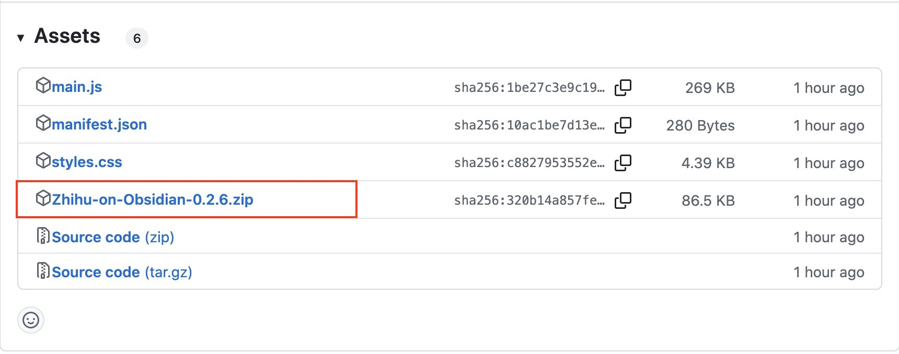
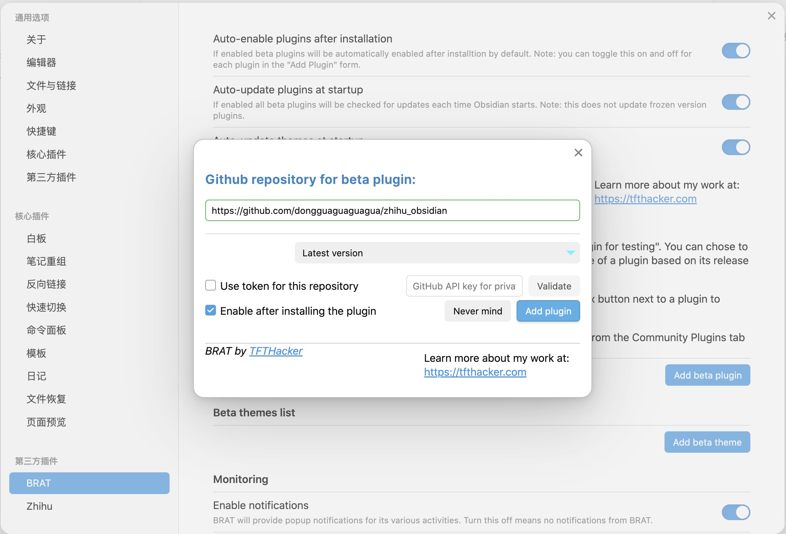

## 在 Obsidian 内安装（推荐）

插件已在 Obsidian 插件库中上架，只需要在 Obsidian 内点击第三方插件（关闭安全模式），浏览社区插件市场，搜索 `Zhihu`，选择第一个插件，点击安装即可。或者还可以[一键在 Obsidian 内打开](obsidian://show-plugin?id=zhihu)。

## 手动安装

进入 Zhihu on Obsidian 的[发布页面](https://github.com/dongguaguaguagua/zhihu_obsidian/releases)，在 Assets 中下载最新的 zip 文件，通常以`Zhihu-on-Obsidian-版本号.zip` 作为文件名。

下载完成后，解压zip文件，将解压后的**文件夹**拖入 Obsidian 的插件目录中。
插件目录一般在你的本地仓库(vault)目录下的.obsidian/plugins下。比如，你把笔记文件都存放在了 `MyVault` 下面，那么需要将 `Zhihu on Obsidian` 文件夹放入
MyVault/.obsidian/plugins/下面。这样，重启 Obsidian 后就可以在设置中看到插件了。

## 通过`BRAT`安装

进入 Obsidian 的插件市场，搜索`BRAT`，点击安装并启用。

进入设置，点击`Add beta plugin`

在弹出的输入框中输入插件仓库地址：`https://github.com/dongguaguaguagua/zhihu_obsidian`，然后点击 `Add plugin`，插件会自动安装并启用。

如果看到第三方插件中有 `Zhihu`，说明安装成功。
