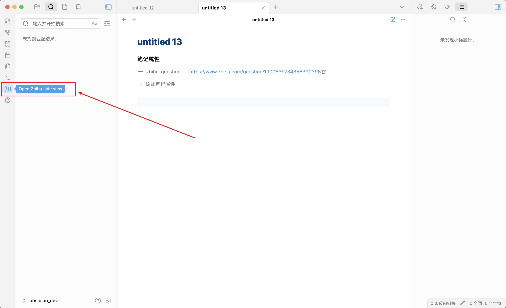
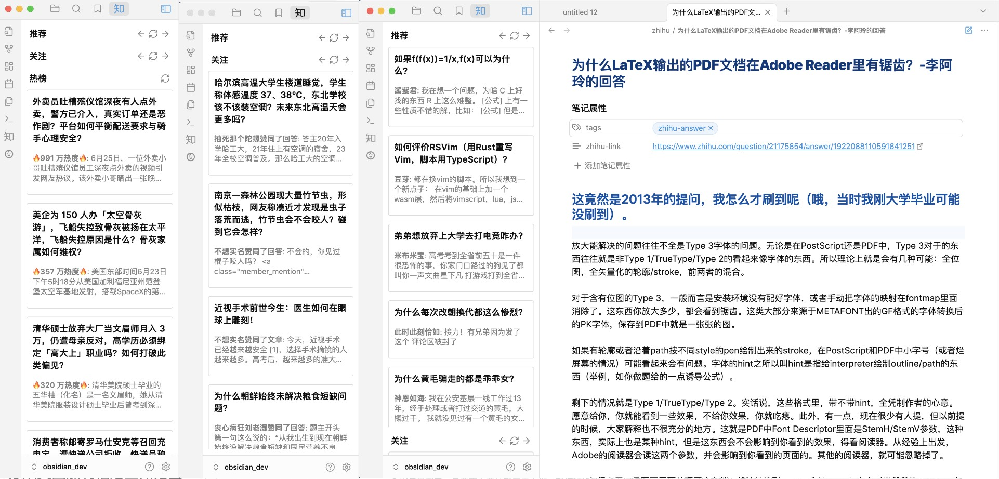

## 推荐、关注和热榜

点击左侧栏的知乎图标，就可以看到当前账号的推荐、关注和热榜。

当您点击侧边栏的文章、回答或想法时，插件会创建一个 markdown 文件让您在 Obsidian 内即可浏览。它有两个属性：

- `tags`:分别是`zhihu-answer`,`zhihu-article`,`zhihu-question`,`zhihu-pin`,中的一个，分别代表回答、文章、问题、想法。
- `zhihu-link`:当前内容的知乎链接。

:::note
打开后的 markdown 文件会存储在vault中，目录是：`./vault/zhihu`
:::

## 打开知乎内容

:::note
待开发，请耐心等待
:::
