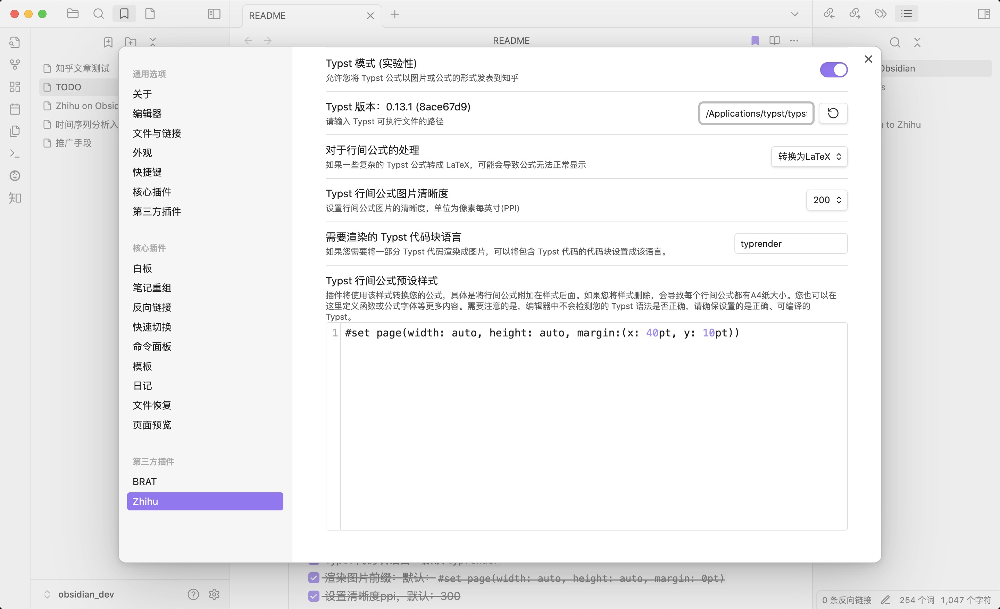
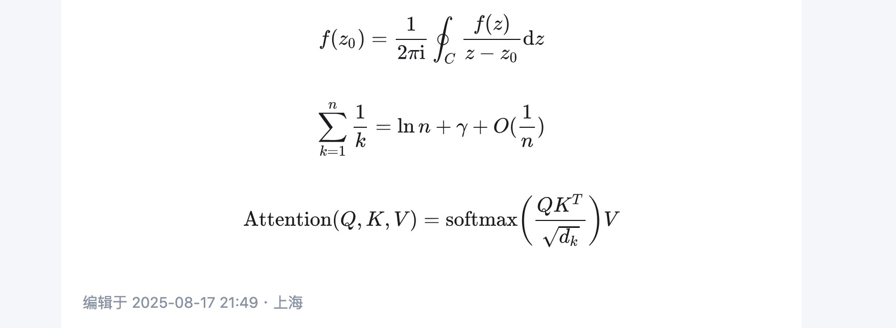
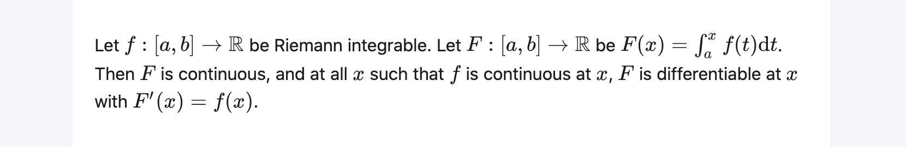
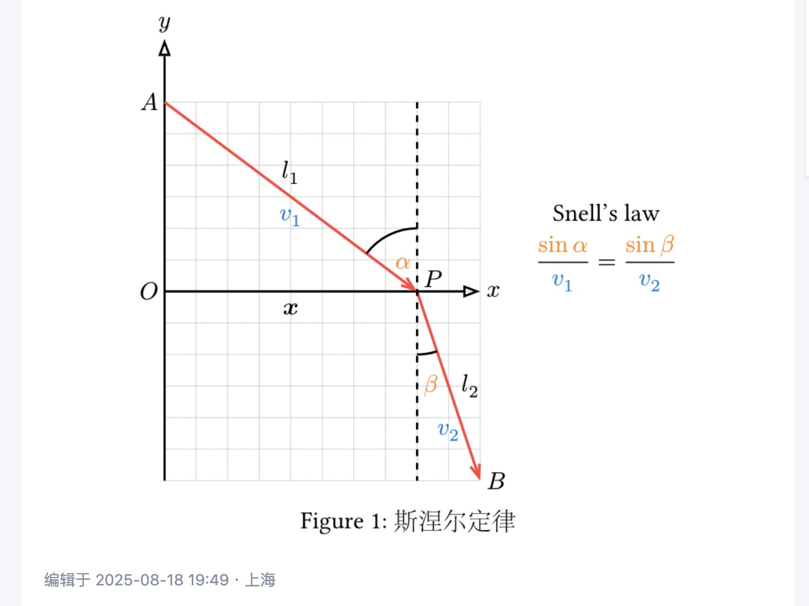
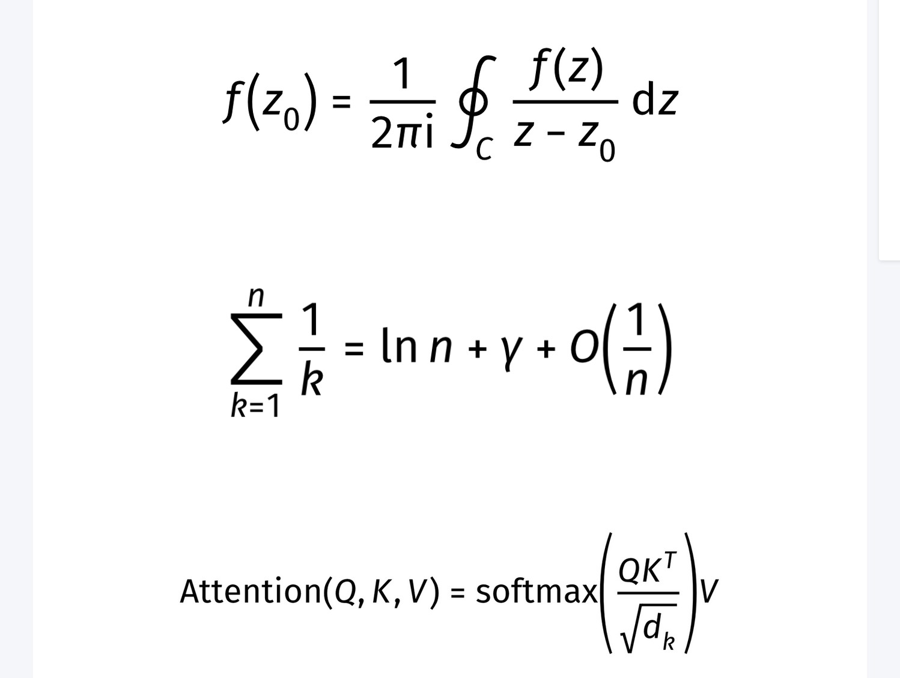

:::warning
Typst 模式目前还是一个实验性功能，欢迎广大 Typst 用户提供反馈。
:::

Typst 模式允许您将原来 LaTeX 公式块中的内容替换成您喜爱的 Typst 公式，或直接渲染 Typst 的代码块。只要可以在 Typst 中通过编译的有效代码，插件都可以正常上传到知乎。

但是 Zhihu on Obsidian 只负责上传到知乎，并不负责 Typst 的渲染。所以为了保证您的编辑体验，推荐安装 [Typsidian](https://github.com/fogsong233/Typsidian) 或者 [Wypst](obsidian://show-plugin?id=wypst)，这两个插件可以将 Typst 公式块实时渲染。

## 设置 Typst 路径

在开始之前，您必须设置 Typst 可执行文件的路径。您可以在 Typst 官方 [GitHub 仓库](https://github.com/typst/typst/releases) 中选择适合您的系统的可执行文件，然后下载到本地并解压。然后将路径添加到设置中：



点击左边的刷新按钮，如果有提示：`Typst 版本：xxx`，并且左边正确显示了 Typst 的版本，则表明 Typst 路径设置成功。如果左边仍然显示 `Typst 版本：未找到`，则说明路径设置不正确。


## Typst 行间公式

Typst 功能可以使您上传 Typst 行内公式到知乎。所以仅需用正常的 markdown 语法包裹 Typst 公式，就可以正确发表到知乎。需要注意行间公式使用`$$`包裹，而不是使用`$+空格`

例如：
```markdown
$$
f(z_0) = 1/(2 pi upright(i)) integral.cont_C f(z)/(z - z_0) dif z
$$
$$
sum_(k = 1)^n 1/k = ln n + gamma + O(1/n)
$$
$$
op("Attention")(Q, K, V) = op("softmax")((Q K^T)/sqrt(d_k)) V
$$
```

示例的渲染结果：



行间公式的渲染有两种方式可供选择：

* 转换成 LaTeX 公式：使用 [tex2typst](https://qwinsi.github.io/tex2typst-webapp/) 将 Typst 公式转换成 LaTeX 公式。这样的好处是公式更加原生，在知乎网页端和手机端都有很好的渲染效果，在公式并不复杂的情况下推荐。缺点是 Typst 并不一定可以原封不动地转换成 LaTeX，一些 Typst 独有的符号或者语法并不能很好地转换。

* 转换成图片：使用 [Typst 命令行](https://github.com/typst/typst) 将 Typst 转换成白底黑字图片。这样渲染的优点是对 Typst 公式有原生支持，只要编译通过的 Typst 均可以正常显示。缺点是在网页端和移动端行间公式以图片的形式显示，在暗色模式的知乎下并不如原生 LaTeX 美观。

## Typst 行内公式

由于知乎不能插入行内图片，所以 Typst 行内公式只能转换成 LaTeX 渲染。例如：

```markdown
Let $f:[a,b] to bb(R)$ be Riemann integrable.
Let $F:[a,b] to bb(R)$ be $F(x)= int_a^x f(t) dif t$.
Then $F$ is continuous, and at all $x$ such that $f$ is continuous at $x$,
$F$ is differentiable at $x$ with $F'(x)=f(x)$.
```

渲染结果：



## Typst 代码块

您还可以将 Typst 代码放入一个特定的代码块中，插件会识别改代码块，调用 Typst 命令行并转换成图片。默认的代码块是`typrender`（您可以在设置中自定义想要的代码块语言）。

您可以在代码块中插入任意合法的 Typst 代码，甚至导入 Typst 包和模板。例如下面是一个用 [CeTZ 包](https://cetz-package.github.io/)演示斯涅耳定律的例子：

````typst
```typrender
#import "@preview/cetz:0.3.0"
#figure(
  cetz.canvas({
  import cetz.draw: *
  let x = 4
  let a = 3
  grid((0, -a), (x + 1, a), step: 0.5, stroke: gray + 0.2pt)
  anchor("X", (x/2, 0))
  content("X", [$bold(x)$], anchor: "north", padding: .1)
  anchor("A", (0, a))
  content("A", [$A$], anchor: "east", padding: .1)
  anchor("B", (x + 1, -a))
  content("B", [$B$], anchor: "west", padding: .1)
  anchor("O", (0, 0))
  content("O", [$O$], anchor: "east", padding: .1)
  anchor("P", (x, 0.2))
  content("P", [$P$], anchor: "west", padding: .1)
  anchor("beta", (x, -1.5))
  content("beta", [$text(#orange, beta)$], anchor: "west", padding: .1)
  anchor("l1", (x/2, a/2))
  content("l1", [$l_1$], anchor: "south", padding: .2)
  content("l1", text(blue)[$ v_1 $], anchor: "north", padding: .2)
  anchor("l2", (x+1/2, -a/2))
  content("l2", [$l_2$], anchor: "west", padding: .2)
  content("l2", text(blue)[$ v_2 $], anchor: "north", padding: .6)
  anchor("equation", (x + 3, a - 2))
  content("equation", text(black)[Snell's law], anchor: "south", padding: .1)
  content("equation", $ text(#orange, sin alpha) /text(#blue, v_1) = text(#orange, sin beta) /text(#blue, v_2) $, anchor: "north", padding: .1)
  line((0, 0), (x + 1, 0), mark: (end: ">")) // x
  content((), $ x $, anchor: "west", padding: .1)
  line((0, -a), (0, a + 1), mark: (end: ">")) // y
  content((), $ y $, anchor: "south", padding: .1)
  line((0, a), (x, 0), stroke: red + 1.2pt, name: "l1", mark: (end: "straight")) // l1
  line((x, 0), (x + 1, -a), stroke: red + 1.2pt, name: "l2", mark: (end: "straight")) // l2
  line((x, a), (x, -a), name: "dotline",stroke: (dash: "dashed"))
  cetz.angle.angle("l1.end", "l1.start", "dotline.start", label: $ text(#orange, alpha) $, radius: 1)
  cetz.angle.angle("l2.start", "l2.end", "dotline.end", radius: 1)
}),
caption: [斯涅尔定律]
)
```
````

渲染结果：



## Typst 预设样式

您可以在设置中修改 Typst 的预设样式。在默认设置中，预设样式是：

```typst
#set page(width: auto, height: auto, margin:(x: 40pt, y: 10pt))
```

它的意思是：将页面大小设置为适应公式，并且将左边距设置成 40pt，右边距设置成 10pt。它可以让公式在知乎上更好的显示。**否则，如果删掉这个样式，那么每个公式都会是一张A4纸大小，即 Typst 默认纸张大小，这一般不是我们想要的**。

此外，您还可以在这里做一些自定义改进，例如设置字体：

```typst
#show math.equation: set text(font: "Fira Math")
```

:::note
使用前请确保您的电脑上安装了 [Fira Math 字体](https://github.com/firamath/firamath/releases)，否则会报错“字体未找到”，渲染将回退到转换成 LaTeX 模式。
:::

下面是渲染效果：



例如自定义函数：

```typst
#let scr(it) = text(
  features: ("ss01",),
  box($cal(it)$),
)
```

markdown 代码：

```markdown
$$
cal(P) != scr(P)
$$
```

显示效果：


