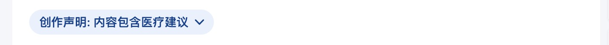
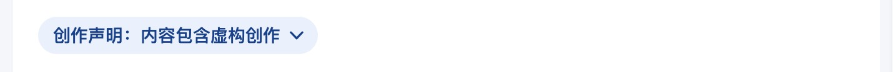
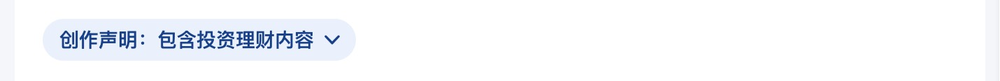
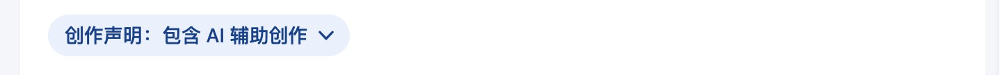

import Tabs from "@theme/Tabs";
import TabItem from "@theme/TabItem";
import DisclaimerTable from "@site/src/components/DisclaimerTable";

您可以在文章和回答中添加创作声明，达到这样的效果：

<Tabs>
    <TabItem value="spoiler" label="包含剧透">
        
    </TabItem>
    <TabItem value="medical_advice" label="包含医疗建议">
        
    </TabItem>
    <TabItem value="fictional_creation" label="虚构创作">
        
    </TabItem>
    <TabItem value="contain_finance" label="理财内容">
        
    </TabItem>
    <TabItem value="ai_creation" label="AI辅助创作">
        
    </TabItem>
</Tabs>

要添加创作声明，您只需要在属性中添加`zhihu-disclaimer`，然后填写下面支持的创作声明：

<DisclaimerTable />
