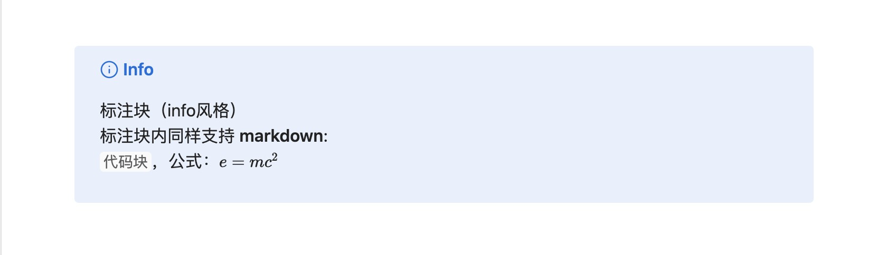

## 标注块介绍

[标注块(Callouts)](https://help.obsidian.md/callouts) 是 Obsidian 特有的语法。它可以丰富版面，提升美观度。

例如：

```markdown
> [!info]
> 标注块（info风格）
> 标注块内同样支持 **markdown**:
> `代码块`，公式：$e=mc^{2}$
```

在 Obsidian 的默认主题下呈现的效果：



标注块还可以自定义标题，如：

```markdown
> [!tip] 自定义标题
> 标注块还可以自定义标题
```


关于标注块的风格样式，或者更多使用方法，可在[官方文档](https://help.obsidian.md/callouts)中查看。

## 知乎标注块

但遗憾的是，知乎并不支持标注块。因此插件会将 Obsidian 笔记中的标注块转换为普通段落，并将标题加粗显示。

例如：

```markdown
> [!info]
> 标注块（info风格）
> 标注块内同样支持 **markdown**:
> `代码块`，公式：$e=mc^{2}$
```

发布到知乎上就是：


## 注释段落

插件允许您用标注块注释您不想发表到知乎的段落。仅需要将标注的类型设置为`ignore`、`忽略`或者`注释`即可。

例如：

```
> [!ignore]
> 忽略内容
> ...一些隐私信息...
```

被标注块包裹的部分就会被忽略，不会被发布到知乎上。
