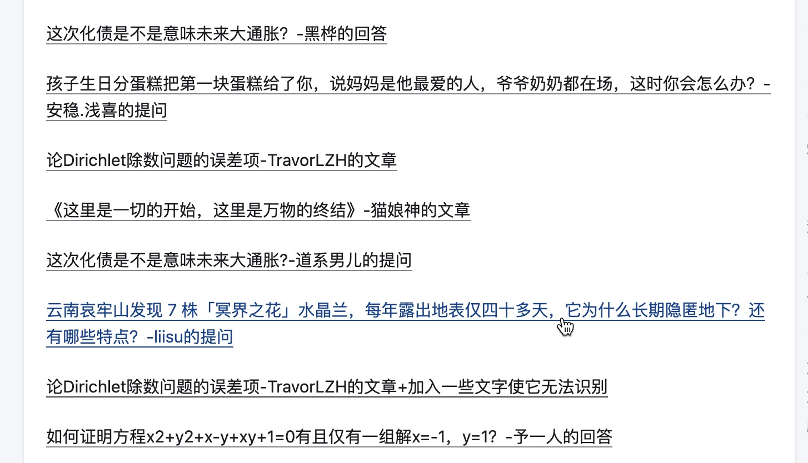

## 卡片链接

将链接变成卡片也非常简单。比如将GitHub官网变成带有GitHub标题的卡片，可以这么写

```markdown

```

效果如下


## Obsidian 内链

您可以使用 Obsidian 的内链语法：`[[链接地址]]` 来链接到其他笔记

* 如果链接到的笔记是一篇知乎文章（也就是带有 `zhihu-link` 属性的文章），那么发布时就会变成一个链接，链接名称是文章的标题，链接地址是文章的URL。

* 如果链接的笔记不是知乎文章（找不到 `zhihu-link` 属性），那么发布时就是一个带有下划线的笔记标题。

* 与图片相似，您也可以使用`[[链接地址|链接名称]]`的语法。

### 内链卡片链接

如果您需要让内链变成卡片链接，那么需要**让内链单独成一行**。这样插件会将其转换为美观的卡片链接。


示例：

```markdown
在 [[上传的GIF都会膨胀10倍?浅谈某乎后端负优化-东瓜瓜瓜瓜的文章|文章]] 中，可以看到...

另起一行：

[[上传的GIF都会膨胀10倍?浅谈某乎后端负优化-东瓜瓜瓜瓜的文章|上传的GIF都会膨胀10倍?浅谈某乎后端负优化]]
```

发布效果：


